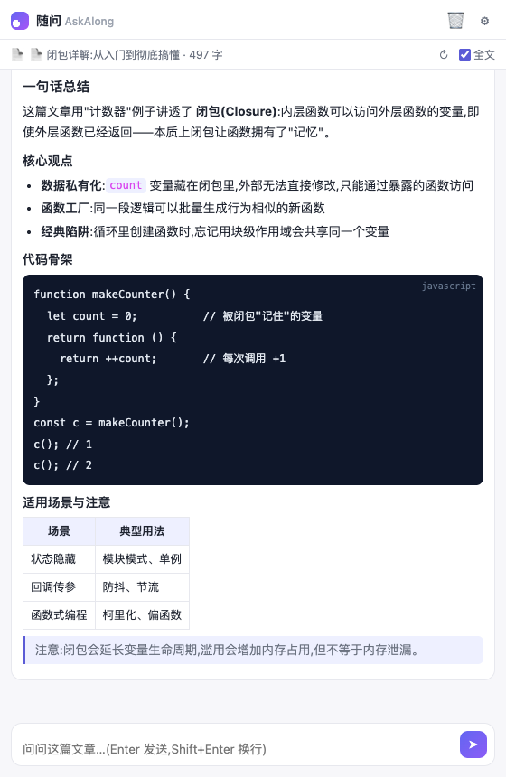
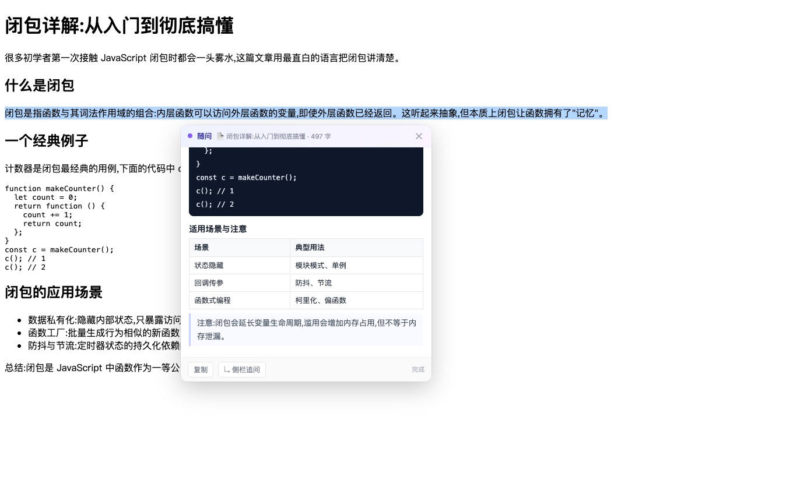
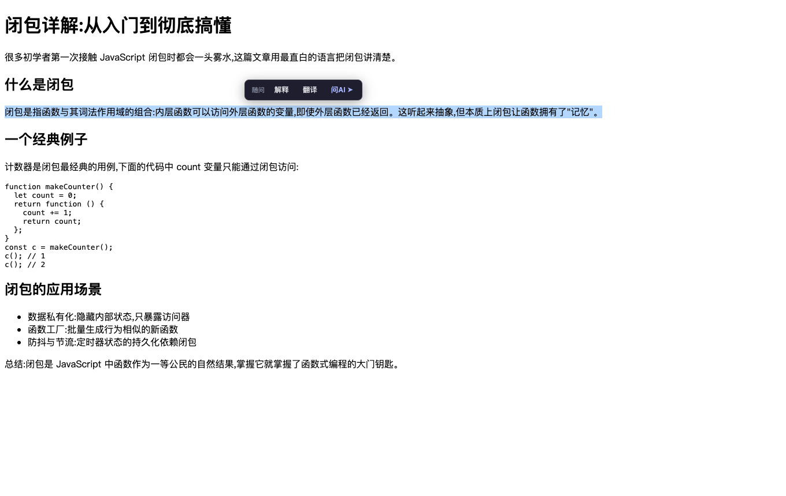
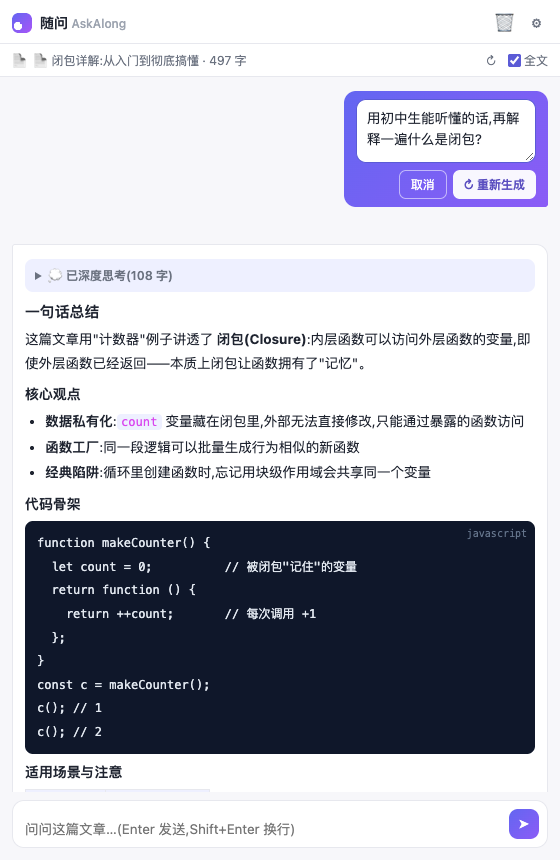

# 随问 AskAlong · 边读边问的 AI 学习助手

> 在知乎、CSDN、掘金、GitHub、公众号、小红书……任何技术文章页面,**划词即问 AI**,自动携带**文章全文**作为上下文。零复制粘贴、零窗口切换。

解决的核心痛点:读技术文章时看不懂某个术语,以前的流程是「选中 → 切到 AI → 粘贴 → 补充上下文 → 提问」,既麻烦,AI 又只能看到一个孤零零的片段。

<p align="center">
  
  
</p>

  

## 效果预览

| 划词工具条 | 编辑重发 |
|---|---|
|  |  |

## 它是怎么解决三个痛点的

| 痛点 | 对策 |
|---|---|
| 频繁复制粘贴 | 划词后浮出工具条:**解释 / 翻译 / 问AI** 一键触发 |
| 频繁切换窗口 | **行内快答卡**直接浮在文字旁流式作答;多轮追问走浏览器**侧边栏**,不离开页面 |
| AI 拿不到文章全貌 | 扩展直接读取页面 DOM 提取**文章全文**,每次提问自动作为上下文发给模型 |

## 功能一览

- **划词工具条**:选中任意文字 → 「解释」「翻译」「问AI」
- **行内快答卡**:流式渲染答案,可复制、可中断,「↳ 侧栏追问」把本轮问答无缝带入侧边栏继续聊
- **侧边栏对话**:每个标签页独立会话(切换标签自动切换上下文与历史);快捷指令:总结全文 / 提炼概念 / 出题自测 / 学习路径;可开关「携带全文」;Esc 或 ■ 随时停止
- **编辑重发**:悬停自己发过的提问 → 「✎ 编辑」→ 原地修改 → 重新生成,自动截断旧对话;停止生成会保留已输出的部分内容
- **多标签页并行**:每个标签页一套独立会话,切换标签不打断后台生成,切回即见完整回答;划选「问AI」的选中文本确定性地随请求带入面板
- **正文提取器**:20+ 平台适配器(见下) + Readability 简化算法兜底,输出 Markdown(保留代码块/表格/列表)
- **长文预算**:默认 16000 字上限(可调),超长自动按「开头 + 完整目录 + 与问题最相关的章节」截断
- **多模型**:任何 OpenAI 兼容接口。预设:智谱 GLM(`glm-5.3-flash`)、DeepSeek、Kimi、OpenAI、本地 Ollama
- **隐私**:API Key 只存本地;文章内容从你的浏览器直连你配置的模型服务,无任何中间服务器

### 支持提取正文的站点(部分)

公众号 `#js_content` · 知乎(专栏/问答全回答) · CSDN · 掘金 · 博客园 · SegmentFault · 简书 · GitHub(README) · StackOverflow(问题+全部回答) · 小红书 · B站专栏 · 少数派 · InfoQ · 腾讯云/阿里云社区 · 51CTO · 菜鸟教程…

其余站点走通用 Readability 兜底算法(按段落密度自动识别正文、过滤广告与页脚导航)。

## 安装(2 分钟)

1. 下载/克隆本项目;
2. 打开 Chrome,访问 `chrome://extensions`;
3. 右上角打开「**开发者模式**」→ 点「**加载已解压的扩展程序**」→ 选择本项目文件夹(`askalong/`);
4. 首次安装会自动打开设置页:选择模型服务(默认智谱 GLM)→ 粘贴 API Key → 点「**测试连接**」→ 保存。
   - 智谱 Key 申请:[open.bigmodel.cn](https://open.bigmodel.cn/usercenter/apikeys)(`glm-5.3-flash`)

> Edge 也兼容:edge://extensions 里同样操作。

## 使用

- **划词提问**:文章里选中一段看不懂的话 → 点「解释」;想要多轮追问点「问AI」打开侧边栏;
- **快捷键**:`Alt+Shift+A` 或点击工具栏图标,随时呼出侧边栏;
- **整篇理解**:打开一篇文章 → 侧边栏点「📝 总结全文」「🧱 提炼概念」「🎯 出题自测」「🧭 学习路径」。

## 项目结构

```
askalong/
├── manifest.json              # MV3 清单(权限:storage + sidePanel)
├── lib/
│   ├── shared.js              # 默认配置 / 模型预设 / 上下文组装 / 长文截断 / 流式客户端
│   └── markdown-lite.js       # 零依赖 Markdown→HTML(输出全转义防注入)
├── content/content.js         # 提取器 + 划词工具条 + 行内快答卡(Shadow DOM)
├── background/service-worker.js # SSE 流式代理 / 侧边栏控制
├── sidepanel/                 # 侧边栏对话(HTML/CSS/JS)
├── options/                   # 设置页(HTML/CSS/JS)
├── icons/                     # 生成的图标(tools/gen-icons.cjs 可再生成)
├── docs/img/                  # README 截图
├── e2e/                       # 端到端测试(mock LLM + Chrome for Testing)
└── tools/gen-icons.cjs        # 图标生成脚本
```

无框架、无构建步骤,全部原生 JS,clone 即可加载,方便自己魔改。

## License

[MIT](LICENSE)
